# dual driver car 双驱车  
实现手机来控制双驱车：前进、加速、后退、左转、右转。打造物联网应用的智能小车！当然控制智能小车不能脱离了wifi的环境丫。现在入门级版搞起……。当然比较厉害的用户会比较关心控制的反应速度，这个每个用户可以自己测试一下。  
 
**思路**： 

- 用一个划片来控制前进、后退，包括加速，复位为停止；  
- 用另一个划片来控制转向，包括左转、右转，同时可以控制转向的速度，复位为保持原先转向前的速度和方向。  

小车的控制视屏已经发到社区，这里小放几张照片展现一下小车英姿，还带着些许跑完越野、不羁的尘土味^^： 
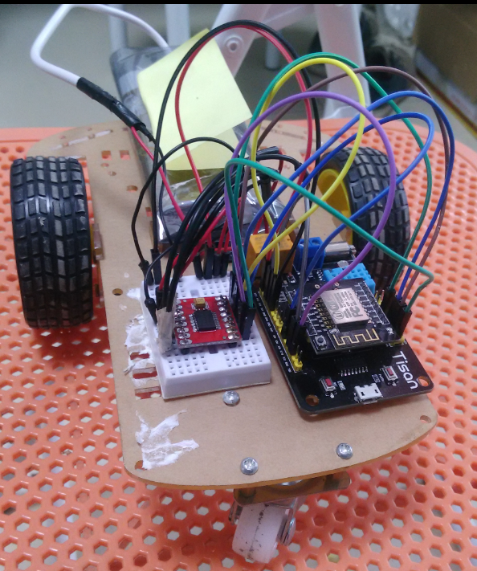  
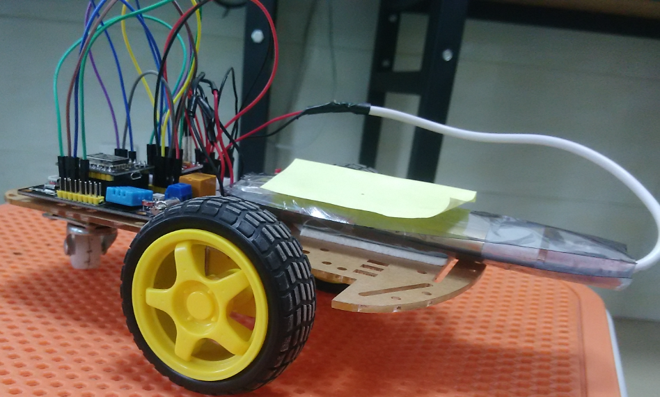  
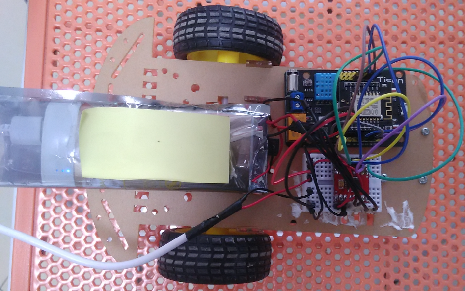  
    


# 准备  
首先，作为一个Tisan开发者，当然要使用Tisan的WebIDE了，这是进行框架开发的必备条件，WebIDE的其他用处暂不多说哈。  
WebIDE的官网：[http://tisan.pandocloud.com/](http://tisan.pandocloud.com/)   
tisan-doc: [tisan-doc](https://sw0813.gitbooks.io/tisan-doc/content/)  
相关的视频教程： [http://i.youku.com/u/UMTIwNTA2MTM2MA==](http://i.youku.com/u/UMTIwNTA2MTM2MA==)  
Tisan论坛链接：[http://bbs.elecfans.com/zhuti_820_1.html](http://bbs.elecfans.com/zhuti_820_1.html)   

## 1.1 硬件  
1. Tisan开发板；  
2. 能上网的wifi路由；  
3. 能上wifi的手机（^^)，支持安卓和iOS；  
4. PC。  
5. 电机驱动模块（驱动芯片为TB6612FNG），是两路直流电机驱动模块，可以到淘宝上购买；[资料链接](http://note.youdao.com/share/?id=f29530933a1372758c409bb93e2a1743&type=note)    
6. 智能小车底盘（包括了直流电机、轮子、底盘等）；
7. 电源模块，这里实验用了充电宝。  

## 1.2 软件  
1. 在PC上下载固件开发的IDE，可到资源中心下载：[http://pan.baidu.com/s/1c0r0ba4](http://pan.baidu.com/s/1c0r0ba4), 具体的开发环境介绍可参考[tisan开发环境介绍](https://sw0813.gitbooks.io/tisan-doc/content/cn/environment.html)  
2. 安装freeiot，下载链接和使用说明请参考[快速体验](https://sw0813.gitbooks.io/tisan-doc/content/cn/quick-start.html)    
3. 如果想用微信控制，可先关注微信公众号：freeiot。  
4. 准备固件烧录工具，也在资源中心下载。  
5. 到开源项目管理网站github下载tisan-demo的源代码：[https://github.com/tisan-kit/tisan-demo/archive/master.zip](https://github.com/tisan-kit/tisan-demo/archive/master.zip)。  

# 2 搭建硬件环境  
参考电机驱动TB6612FNG的资料，Tisan开发板与驱动板和电机的连线管脚对应表：  

| 项 | TB6612FNG驱动板 | Tisan板IO编号  | 电机 | 说明 |   
| -- | :------------ | :----------- | :-- | :-- |  
| 1  | PWMA  | GPIO12 |  |  |  
| 2  | PWMB  | GPIO15 |  |  | 
| 3  | AIN1  | GPIO13 |  |  | 
| 4  | AIN2  | GPIO14 |  |  | 
| 5  | BIN1  | GPIO2  |  |  | 
| 6  | BIN2  | GPIO4  |  |  | 
| 7  | A01   |        | 1电机管脚1 |  |  
| 8  | A02   |        | 1电机管脚2 |  |  
| 9  | B01   |        | 2电机管脚1 |  |  
| 10 | B02   |        | 2电机管脚2 |  |  
| 11 | STBY  |        |           | 接3.3V高电平 |
| 11 | VM    |        |           | 5到12V电源 |  
| 12 | VCC   |        |           | 5V电源 |  
| 13 | GND   |  GND   |           | 共地 |  


连线示意图如下：  
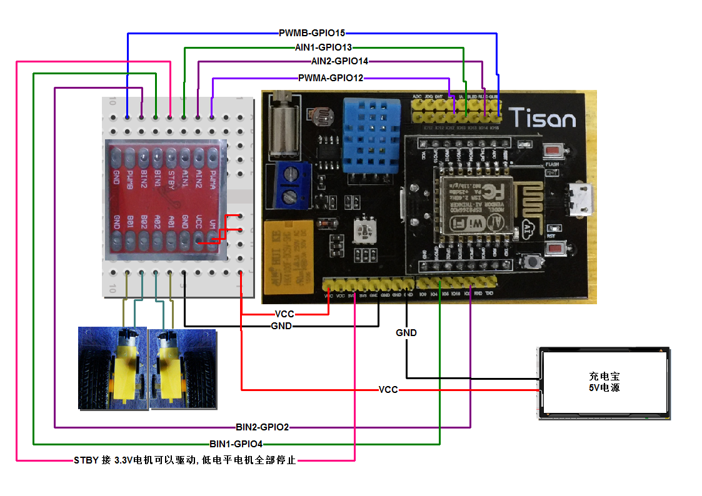   


# 3 在WebIDE上创建产品  
## 3.1 创建双驱车产品  
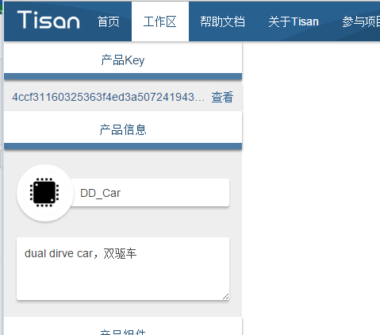   
创建后需要保存，否则产品无效。  

## 3.2 添加划片（分别是电机驱动和转向划片） 
WebIDE上划片是电机对象，所以拖两个电机对象：  
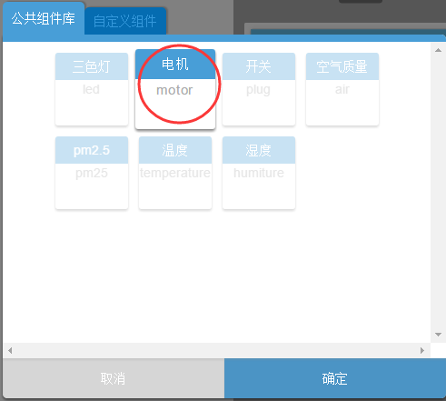  
添加划片和更改标签名如图：  
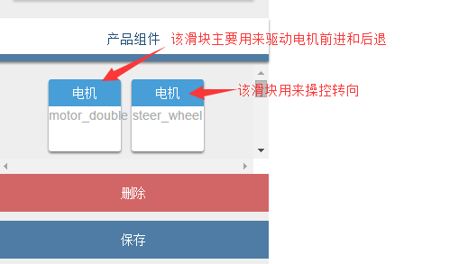  

## 3.3 控制界面说明  

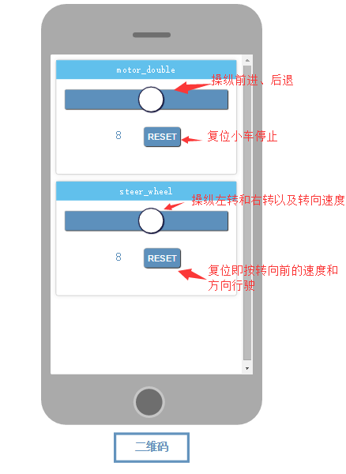  

## 3.4 保存添加  
点击保存，WebIDE的产品工作区右边的控制界面会更新。

# 4 固件开发   
在固件开发的IDE上导入下载的 Tisan-demo 源码工程，如图：  
  

## 4.1 更新产品Key  
复制WebIDE上创建的(DD_Car)产品key到device_config.h 文件中：  
  

## 4.2 处理产品对象代码  
将WebIDE上创建的产品对象(motor_double 和 steer_wheel)的代码复制添加到 app/user/objects 目录下，如图：  
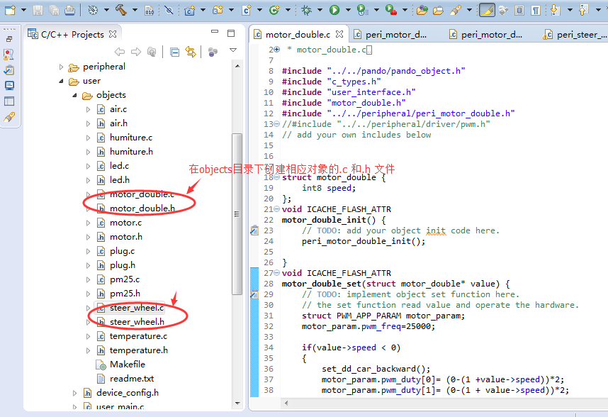  

### 4.2.1 创建外设驱动文件  
为了支持object的功能，需要进行相应的外设驱动开发。本应用涉及到电机驱动芯片，主要需要PWM功能和普通IO功能。新的外设驱动开发的可以参考其他现有外设驱动代码，具体是实现object里面的get和set方法，负责将控制指令在外设上实现。  

添加相应object的外设文件（motor_double 的外设文件：peri_motor_double.c 和 peri_motor_double.h; steer_wheel 的外设文件：peri_steer_wheel.c 和 peri_steer_wheel.h），如图：  
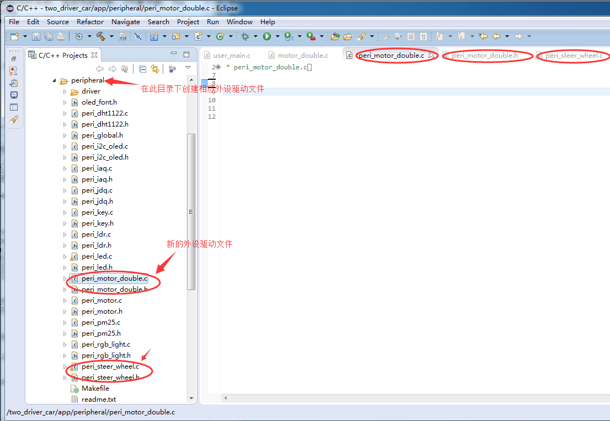  

### 4.2.2 实现外设驱动  
motor_double对象实现小车前进、后退、加速的功能，由于电机驱动模块驱动的是双电机，实现该功能需要两个PWM的管脚来驱动。并根据驱动芯片的资料，在steer_wheel的外设文件中封装好前进、后退、向左、向右的配置函数，具体做法如下：  
- 因为要用的PWM功能，需要引入驱动文件`#include "driver/pwm.h"`;  
- 在peri_steer_wheel文件中定义和初始化配置IO口，定义转向函数（前进、后退、向左、向右）；  
- 在peri_steer_wheel文件中声明定义了双驱车的状态，该状态只是了小车的驱动速度和方向`struct DD_CAR_STATE dd_car_state = {0,  dd_forward};`;  
- 在motor_double对象中初始化驱动IO（PWMA和PWMB）；  
- 在motor_double对象的设置函数中获取驱动值和方向，同时保存到*dd_car_state*变量中，并调用外设驱动函数设置电机的值；   
- 在steer_wheel对象中调用初始化配置IO的函数；
- 在steer_wheel对象的设置函数中获取小车转向的方向和转动值，值越大转向越大，复位后小车将保持转向前的状态；  

peri_steer_wheel.h 有关声明定义如下：  

```c  
#include "c_types.h"
#include "driver/pwm.h"
#include "peri_global.h"


enum DD_DIRECTION{ dd_forward, dd_backward, dd_left, dd_right} dd_diection;

struct DD_CAR_STATE
{
	uint8 speed;
	enum DD_DIRECTION direction;   //1: forward; 2:backward; 3:left; 4:right;
};
extern struct DD_CAR_STATE dd_car_state;
```

peri_steer_wheel.c 最终代码实现如下：  

```c  
#include "peri_steer_wheel.h"
#include "driver/gpio.h"
#include "driver/tisan_gpio.h"
#include "eagle_soc.h"
#include "driver/uart.h"
#include "driver/gpio16.h"

#define PIN_AIN1    13
#define PIN_AIN2	14
#define PIN_BIN1	4
#define PIN_BIN2	2

#define SET_PIN_AIN1(x)		GPIO_OUTPUT_SET(PIN_AIN1, x)
#define SET_PIN_AIN2(x)		GPIO_OUTPUT_SET(PIN_AIN2, x)
#define SET_PIN_BIN1(x)		GPIO_OUTPUT_SET(PIN_BIN1, x)
#define SET_PIN_BIN2(x)		GPIO_OUTPUT_SET(PIN_BIN2, x)

static uint8 ain1 = 0;
static uint8 ain2 = 0;
static uint8 bin1 = 0;
static uint8 bin2 = 0;

struct DD_CAR_STATE dd_car_state = {0,  dd_forward};

void ICACHE_FLASH_ATTR
set_dd_car_forward(void)
{
	SET_PIN_AIN1(0);
	SET_PIN_AIN2(1);
	SET_PIN_BIN1(0);
	SET_PIN_BIN2(1);
}

void ICACHE_FLASH_ATTR
set_dd_car_backward(void)
{
	SET_PIN_AIN1(1);
	SET_PIN_AIN2(0);
	SET_PIN_BIN1(1);
	SET_PIN_BIN2(0);
}

void ICACHE_FLASH_ATTR
set_dd_car_turn_left(void)
{
	SET_PIN_AIN1(0);
	SET_PIN_AIN2(0);
	SET_PIN_BIN1(0);
	SET_PIN_BIN2(1);
}

void ICACHE_FLASH_ATTR
set_dd_car_turn_right(void)
{
	SET_PIN_AIN1(0);
	SET_PIN_AIN2(1);
	SET_PIN_BIN1(0);
	SET_PIN_BIN2(0);
}

void ICACHE_FLASH_ATTR
set_dd_car_stop(void)
{
	SET_PIN_AIN1(0);
	SET_PIN_AIN2(0);
	SET_PIN_BIN1(0);
	SET_PIN_BIN2(0);
}

void ICACHE_FLASH_ATTR
set_dd_car_direction(enum DD_DIRECTION direction)
{
	switch(direction)
	{
	case dd_forward:	set_dd_car_forward();
		break;
	case dd_backward:	set_dd_car_backward();
		break;
	case dd_left:	set_dd_car_turn_left();
		break;
	case dd_right:	set_dd_car_turn_right();
		break;
	default:	set_dd_car_stop();
		break;
	}
}

void ICACHE_FLASH_ATTR
peri_steer_wheel_init(void)
{
//    PRINTF("I am the dd_car direction_gpio\n");

	PIN_FUNC_SELECT(tisan_get_gpio_name(PIN_AIN1), tisan_get_gpio_general_func(PIN_AIN1));
	PIN_PULLUP_EN(tisan_get_gpio_name(PIN_AIN1));

	PIN_FUNC_SELECT(tisan_get_gpio_name(PIN_AIN2), tisan_get_gpio_general_func(PIN_AIN2));
	PIN_PULLUP_EN(tisan_get_gpio_name(PIN_AIN2));

	PIN_FUNC_SELECT(tisan_get_gpio_name(PIN_BIN1), tisan_get_gpio_general_func(PIN_BIN1));
	PIN_PULLUP_EN(tisan_get_gpio_name(PIN_BIN1));

	PIN_FUNC_SELECT(tisan_get_gpio_name(PIN_BIN2), tisan_get_gpio_general_func(PIN_BIN2));
	PIN_PULLUP_EN(tisan_get_gpio_name(PIN_BIN2));


	set_dd_car_forward();

}

```

peri_motor_double.c配置了电机驱动IO，代码实现如下：  

```c  
#include "peri_motor_double.h"
#include "user_interface.h"

#define PIN_PWMA	12
#define PIN_PWMB	15

struct PWM_APP_PARAM motor_forward_param={25000,40,0};
struct PWM_APP_PARAM motor_backard_param={25000,0,40};

/******************************************************************************
 * FunctionName : peri_motor_get.
 * Description  : get the parameter of the motor status.
 * Parameters   : none
 * Returns      : the parameter of the motor status.
*******************************************************************************/

struct PWM_APP_PARAM ICACHE_FLASH_ATTR
peri_motor_double_get(void)
{
    struct PWM_APP_PARAM ret;

//    spi_flash_read((PRIV_PARAM_START_SEC + MOTOR_FLASH_PRIV_SAVE) * SPI_FLASH_SEC_SIZE,
//    	(uint32 *)&ret, sizeof(struct PWM_APP_PARAM));
    return ret;
}


/******************************************************************************
 * FunctionName : peri_motor_set.
 * Description  : set the parameter of motor status.
 * Parameters   : struct LIGHT_PARAM motor_param.
 * Returns      : none
*******************************************************************************/

void ICACHE_FLASH_ATTR
peri_motor_double_set( struct PWM_APP_PARAM motor_param)
{
    pwm_set_freq(motor_param.pwm_freq);
    pwm_set_duty(motor_param.pwm_duty[0], 0);
    pwm_set_duty(motor_param.pwm_duty[1], 1);
   // pwm_set_duty(motor_param.pwm_duty[2], 2);

    pwm_start();

//    spi_flash_erase_sector(PRIV_PARAM_START_SEC + MOTOR_FLASH_PRIV_SAVE);
//	spi_flash_write((PRIV_PARAM_START_SEC + MOTOR_FLASH_PRIV_SAVE) * SPI_FLASH_SEC_SIZE,
//	    (uint32 *)&motor_param, sizeof(struct PWM_APP_PARAM));
}

/******************************************************************************
 * FunctionName : peri_motor_init
 * Description  : motor initialize , mainly initialize pwm mode
 * Parameters   : struct LIGHT_PARAM motor_param,struct LIGHT_INIT motor_init
 * Returns      : none
*******************************************************************************/
void ICACHE_FLASH_ATTR
peri_motor_double_init(void)
{
    PRINTF("I am the dual-motor\n");
    struct PWM_APP_PARAM motor_param;
	struct PWM_INIT motor_init;
	motor_param.pwm_freq=25000;
	motor_param.pwm_duty[0]=0;
	motor_param.pwm_duty[1]=0;

	motor_init.io_num=2;
	motor_init.io_id[0]=PIN_PWMA;
	motor_init.io_id[1]=PIN_PWMB;


//    spi_flash_write((PRIV_PARAM_START_SEC + MOTOR_FLASH_PRIV_SAVE) * SPI_FLASH_SEC_SIZE,
//    	    (uint32 *)&motor_param, sizeof(struct PWM_APP_PARAM));

    PRINTF("finished \n");
    pwm_init(motor_param,motor_init);
    pwm_start();

}
```

### 4.2.3 将外设驱动的功能合进对象相应的功能函数里面  
在object中引用相应的外设.h文件，补充对象的初始化函数，如get、set函数。  
对象motor_double中主要用了set函数： 
  
```c  
void ICACHE_FLASH_ATTR
motor_double_set(struct motor_double* value) {
	// TODO: implement object set function here.
	// the set function read value and operate the hardware.
	struct PWM_APP_PARAM motor_param;
	motor_param.pwm_freq=25000;

	if(value->speed < 0)
	{
		set_dd_car_backward();
		motor_param.pwm_duty[0]= (0-(1 +value->speed))*2;
		motor_param.pwm_duty[1]= (0-(1 + value->speed))*2;
		dd_car_state.speed = (0-(1 + value->speed))*2;
		dd_car_state.direction =  dd_backward;
	}
	else
	{
		set_dd_car_forward();
		motor_param.pwm_duty[0]= (value->speed)*2;
		motor_param.pwm_duty[1]= (value->speed)*2;
		dd_car_state.speed = (value->speed)*2;
		dd_car_state.direction = dd_forward;
	}

	PRINTF("\n steer wheel speed:%d, general speed:%d\n",value->speed, dd_car_state.speed);
	peri_motor_double_set(motor_param);

}
```   
对象steer_wheel对象中主要用了set函数： 
 
```c  
void ICACHE_FLASH_ATTR
steer_wheel_set(struct steer_wheel* value) {
	// TODO: implement object set function here.
	// the set function read value and operate the hardware.
	struct PWM_APP_PARAM motor_param;
	motor_param.pwm_freq=25000;

	if(value->speed == 0)
	{
		set_dd_car_direction(dd_car_state.direction);

		motor_param.pwm_duty[0]=dd_car_state.speed;
		motor_param.pwm_duty[1]=dd_car_state.speed;
	}
	else if(value->speed < 0)
	{
		//	set_dd_car_turn_left();

		if(dd_car_state.speed/2 <= (0-(1 + value->speed)))
		{
			motor_param.pwm_duty[1] = 0;
		}
		else
		{
			motor_param.pwm_duty[1] = (dd_car_state.speed/2 + value->speed + 1)*2;
		}
		motor_param.pwm_duty[0]=dd_car_state.speed;
	}
	else
	{
		//set_dd_car_turn_right();
		if(dd_car_state.speed/2 <= value->speed)
		{
			motor_param.pwm_duty[0] = 0;
		}
		else
		{
			motor_param.pwm_duty[0] = (dd_car_state.speed/2 - value->speed)*2;
		}

		motor_param.pwm_duty[1]=dd_car_state.speed;

	}

	PRINTF("\n steer wheel speed:%d, general speed:%d\n",value->speed,dd_car_state.speed );
	peri_motor_double_set(motor_param);

}
```  

## 4.3 处理user_main.c文件  
在user_main.c文件里引用新对象头文件：  

```c  
#include "objects/motor_double.h"
#include "objects/steer_wheel.h"
```  
在入口函数user_init(void)里面禁用wifi配置键（用自动wifi配置功能），添加新的对象初始化函数，代码如下：  

```c  
void user_init(void)
{
	uart_init(115200, 115200); // serial bound rate:11520.

	//long press gpio4, enter into wifi config mode.
//	peri_config_key_init(4);
//	base_keys_init();               //base keys init at the last of every single key init.

	auto_check_connect_init();

	// add you object init here.
	//led_object_init();
	steer_wheel_object_init();
	motor_double_object_init();

	pando_framework_init();
}
```  

# 5 编译并烧录固件  
编译和烧录固件请参考 tisan-doc 的开发环境介绍。  
烧录成功后，复位开发板，板子即正常运行。  
# 6 配置开发板上网并且添加设备  
等待10多秒，如果板子上不了网，信号灯会自动快闪提示进入配置模式，此时可进行wifi配置，配置成功后进入控制界面如下：  
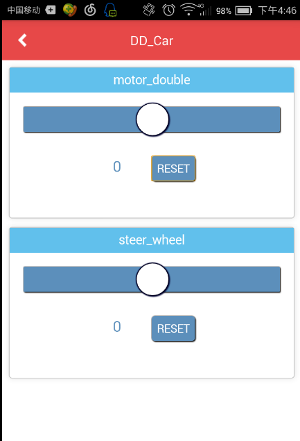  

# 不足和需要改善的地方  
1. WebIDE上没有方向盘对象，用划片来表示感觉比较low，虽然效果上还是可以^^；  
2. 加个车灯； 
3. 转向添加加权系数，控制转向的灵敏度；  

